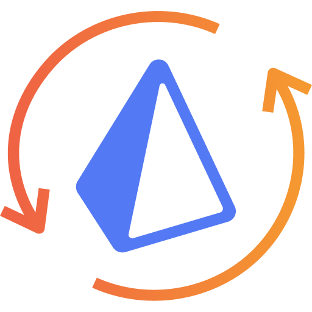

    

# Prisma-AppSync &middot;  

**Prisma-AppSync** is a custom [Prisma 2.0](https://www.prisma.io) generator that automatically spawns code of a fully working GraphQL CRUD API, designed for AWS AppSync.

> ⚠️ ⚠️ Prisma-AppSync is highly experimental and it is not recommended to use in Production at this stage. Feedback, suggestions and PRs welcomed.

## ✨ Automatically generated

- **GraphQL Schema:** Designed to work with AWS AppSync scalar types and directives.
- **Client:** Prisma Client on steroids, that can handle CRUD operations out-of-the-box.
- **API Docs:** Documentation for the GraphQL CRUD API ([see example](/demo/post.html)).

## ✔️ Features

- AppSync CRUD API (get/list/create/update/delete/deleteMany).
- Extensible TypeScript Class with support for hooks and custom resolvers.
- Support for AppSync authorization modes, as well as fine-grained access control.
- Real-time subscriptions (onCreated/onUpdated/onDeleted).
- Exposes Prisma relation queries (create/connect/connectOrCreate/update/upsert/delete/disconnect/set/updateMany/deleteMany).
- Full CloudWatch logs for easy debugging on AWS.
- XSS data sanitization by default.

## ⚓ Compatibility

- Prisma 2.16.1

## 📓 Documentation

[Read the documentation](https://prisma-appsync.vercel.app) to get started with Prisma-AppSync.

## 🎬 Getting started video

## 🧙‍♂️ Contributors

<table>
      <tr>
        <td align="center"><a href="https://github.com/maoosi"> <b>Sylvain S.</b></a></td>
    </tr>
</table>
